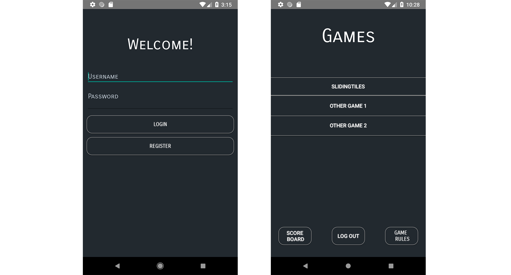
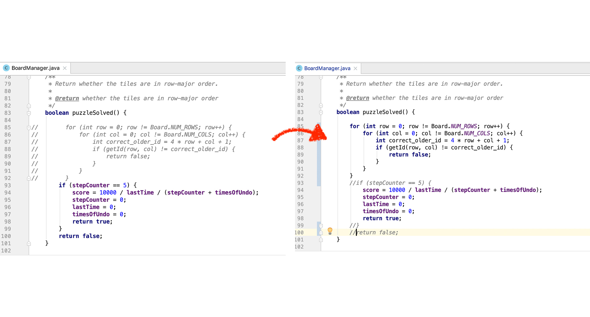

#Group 0505 Game Instructions
*Please also download the screenshots folder to show the image, thank you~

##Some words
we started with 3 people, but finished as a group of 2, 
just me and Jiahe Lyu, since one of our team member dropped one day before the ddl...

So we work really hard on that, slept 4-5 hours in the last several days, 
just want to finish this,if there are anything that's not perfect we will improve it in Phase 2, but please consider this, and we hope you enjoy our game! 
 
o(〃'▽'〃)o
## Login/Register

1. Please clone the whole markus repo to your computer and open the project using Android Studio. Set GameCentre folder as the root repository.
2. Wait patiently until Android Studio finishes building. 
3. If you are using Virtual Devices to test our game functions, please use Pixel 2 API 27.
4. Run the app by clicking the small green triangle at the top.
5. Create an account by typing in a username and a password and click "Register", then you can log in to your account by typing your username and password again and click "Login".
6. You can use the same account next time when you come back.
## Choose Games

1. Now choose the game to play, 
 
-- Score Board: unique score board for this user
 
-- Log out
 
-- Game rules
2. Choose the game difficulty.
9. Choose to start new game or load old game.
 
-- leaderboard: unique score board for this game, with highest score user rank first
##Play(we finished bonus part)!

1. The left bottom corner shows the time you have spent on this round. 
 
-- You can also upload the image you want.
#####Upload twice, since the first time is to get permission and the second time is to upload the image~
2. To undo a step, click on "Undo" button on the right bottom corner. You can choose to undo until you reach the original state of game.
3. You game score will be calculated in such a way that the score gets lower as you take more time to win, use more steps, or use more undos.
4. Once you start, the game will be saved automatically for every 2 seconds. You can also save manually by exiting the game and click on "Save" button.
5. To load old game, click on "Load Saved Game" to continue your last saved game.
###Notice: For your checking convenience we changed the puzzleSolved() so that you can see the "win" result after 5 steps of move: )
if your want to change it back, you can change the line 83-102 as showned below:

##Log out
6. Once you win, check your score and your highest score on the screen. Get a higher score to beat the current "high score"!
7. Click "Try Again" to play the same game at the same difficulty again.
17. You can log out by going back to the screen where you chose the game. Press "Log Out" and welcome back at any time!
18. You can create multiple accounts on your phone.
19. Enjoy!