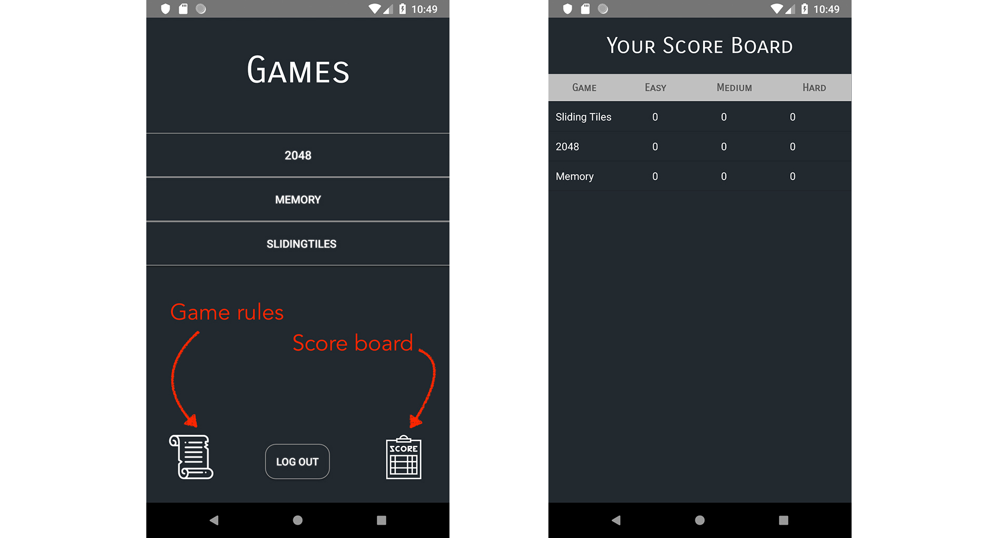
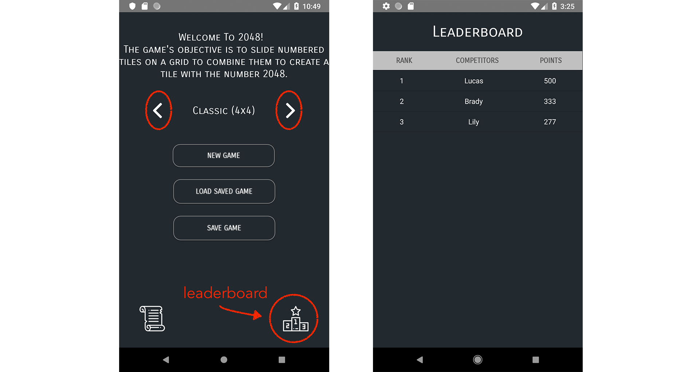
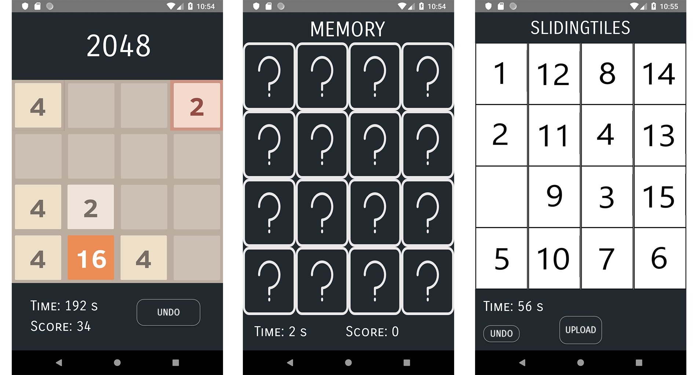
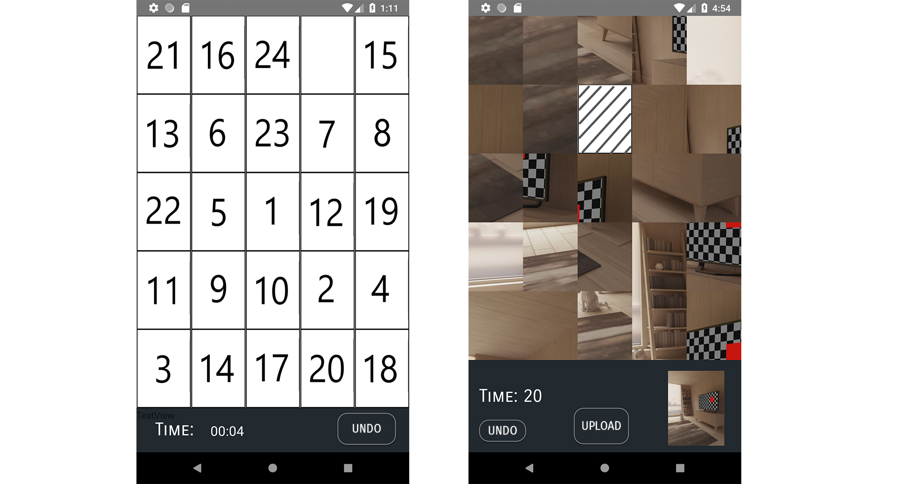
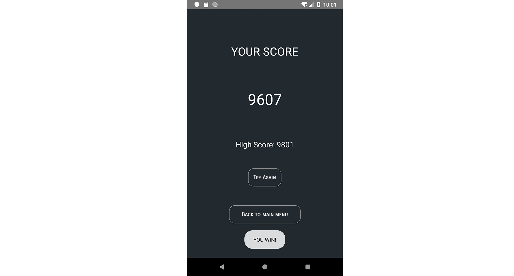

# Game Instructions
*Our codes are in the Phase2 folder, please take a look~

We finished as a group of 3 people, and we worked really hard on this, we hope you enjoy our game! 
 
o(〃'▽'〃)o

## Major Controbution
##### Tzu-Ching Yen: 
* Design and implement the game "Memory"
* Implemented feature to make “Sliding Tile” game solvable
* Unit tests for some of “Sliding Tile” and most of “Memory”
##### Jiahe Lyu:
* Design and implement the game "2048"
* Extract to superclasses including “GenericTile”, “GenericBoard”, “GenericBoardManager”, “GenericStartingActivity” and “GenericGameActivity”
* Unit tests for all about game “2048”
##### Zhuoyue Lyu (Me):
* Refactor all activity classes (Follow MVC) to View and Controller
* Build SQLite databaseHelper, scoreboard/leaderboard (Adapter pattern) 
* Wrote Instrumented tests for all controllers. Redesign the UI and regroup classes into 5 packages.

## Design pattern/Cool codes
* **MVC pattern:**  (you can see all those controller and activities in the "viewAndController" folder )Activities, GenericBoardManager, and MovementController employ the MVC pattern. These are View, Model, and Controller respectively. This design pattern greatly reduce the logic needed in activities and leads to better coverage.

* **Adapter pattern**:  under the "viewAndController" folder: LeaderboardListViewAdapter, ScoreboardListAdapter, CustomAdapter follows adapter Pattern, allows the interface of an existing class to be used as another interface. Here they are responsible for showing leaderboard, scoreboard and gameboard respectively.

* **Factory Pattern:**  BoardManagerBuilder (we used ealier, but delete it before uploading) used Factory Pattern, the Builder class itself also uses Singleton Pattern. Using these patterns gives us an unified syntax to construct BoardManager for different game. It also leads to a cleaner code in constructing a starting activity for all game. 

* **Singleton pattern:** BoardManagerSaveLoader used Singleton pattern. The pattern allow us to eliminate duplicate code in the activities. It also leads to better test coverage.

* **Generic**:  we create generic class for Board, BoardManager, Tile, startingActivity, which makes adding new game be quite easy! 

* **Instrumented test&Mock**:  in the androidTest folder, we've learned how to Mock in the mini lecture~

* **SQlite Database:**  we've done some research which said it's 35% faster than using file system and interal storage; And more secure,  since it relies on the file system for all database permissions, which makes enforcing storage quotas difficult and enforcing user permissions impossible.

* **SharedPreferences:**  which keeps tracking whether the game was in login mode or not

## Login/Register

1. Please clone the whole markus repo to your computer and open the project using Android Studio. Set GameCentre folder as the root repository.
2. Wait patiently until Android Studio finishes building. 
3. If you are using Virtual Devices to test our game functions, please use Pixel 2 API 27.
4. Run the app by clicking the small green triangle at the top.
5. Create an account by typing in a username and a password and click "Register", then you can log in to your account by typing your username and password again and click "Login".
6. You can use the same account next time when you come back.
7. You can also create multiple accounts on your phone.
## Choose Games

1. Now choose the game to play, 
* 2048 (we wrote it by ourselves , based on the code for sliding tiles)
* Memory (A card game, we wrote by ourselves too, based on the code for sliding tiles)
* Sliding Tiles (You know it~)
2. Then we also have several buttons at the bottom

* Game rules
* Log out
 
* Score Board: unique score board of this user (for all three games and three difficulties(size))
## Before you start the game...

1. Once you choose the game you want to play, you will see a new screen, where you can 
* Select the size of the board on the top, by clicking the left & right arrow (the default size for all games was set to 4x4)
* Choose to start new game or load old game by clicking the corresponding button.
* See leaderboard (unique score board for this game, with highest score user rank first) 
* See rules on the bottom-left corner

## Play!

### *For Sliding Tiles:
* The bottom-left corner shows the time and there is an undo button over there. You can choose to undo until you reach the original state of game.
 

* ! It takes some time (around 25s~1min) to load the sliding tiles game, since the app is running makeSolvable(), we haven't find efficient way to solve this yet. please be patient~
* you can also upload the image you want.

##### Upload twice, since the first time is to get permission and the second time is to upload the image~

### For 2048 and Memory game

* The bottom-left corner shows the time and score you have, again, you can undo your steps
* You game score will be calculated in such a way that the score gets lower as you take more time to win, use more steps, or use more undos (we use exponential function to get the score)
* Once you start, the game will be saved automatically for every 2 seconds. You can also save manually by exiting the game and click on "Save" button.
* To load old game, click on "Load Saved Game" to continue your last saved game.

## Win & Log out

1. Once you win, check your score and your highest score on the screen. Get a higher score to beat the current "high score"!

2. You can log out by going back to the screen(click "Back to main menu") where you chose the game. Press "Log Out" and welcome back at any time!

## Thank you!
